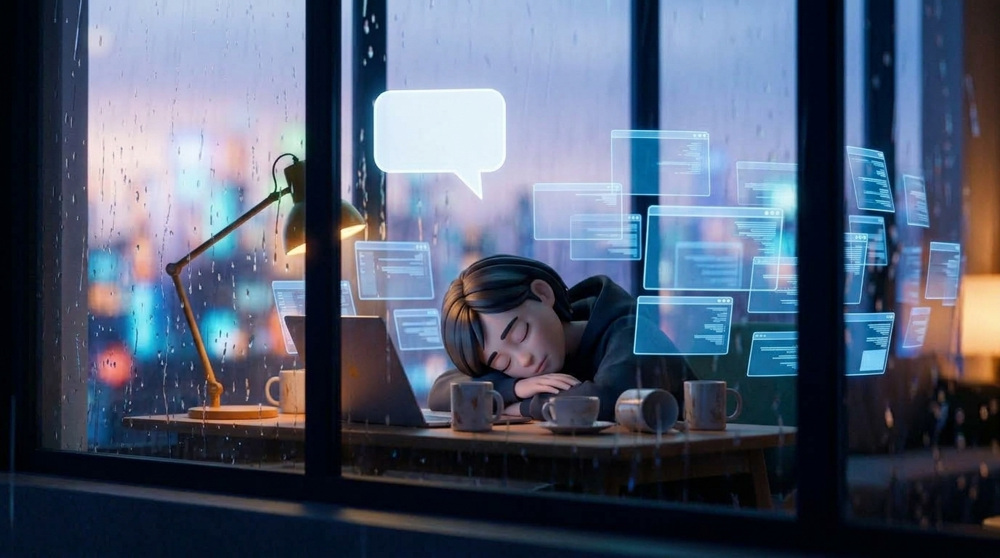
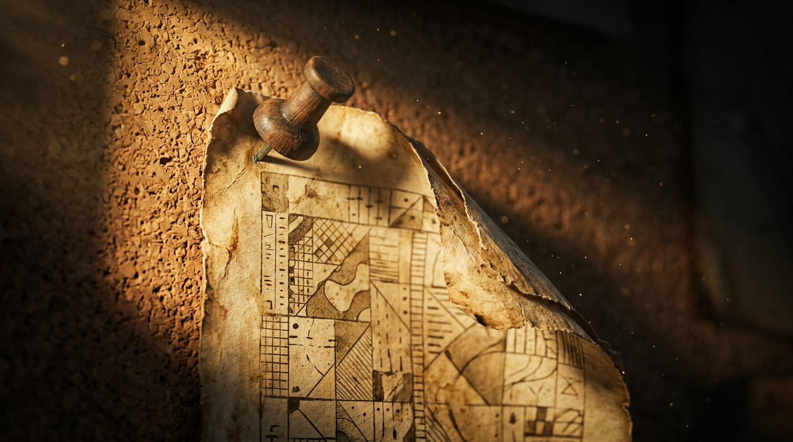
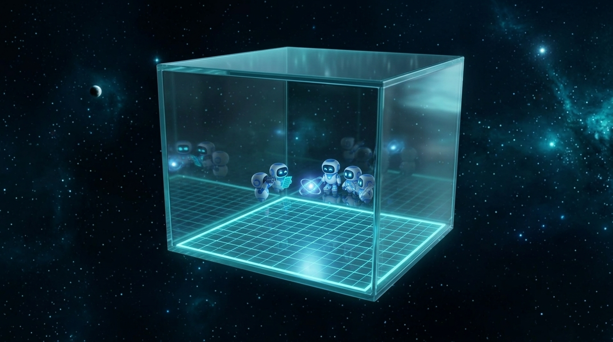
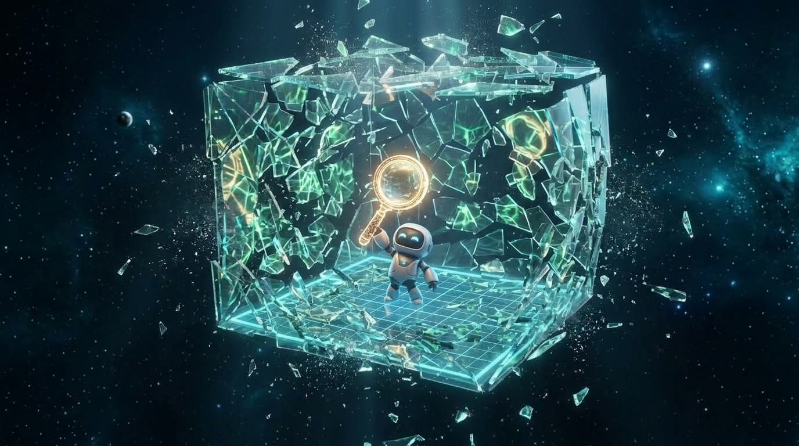
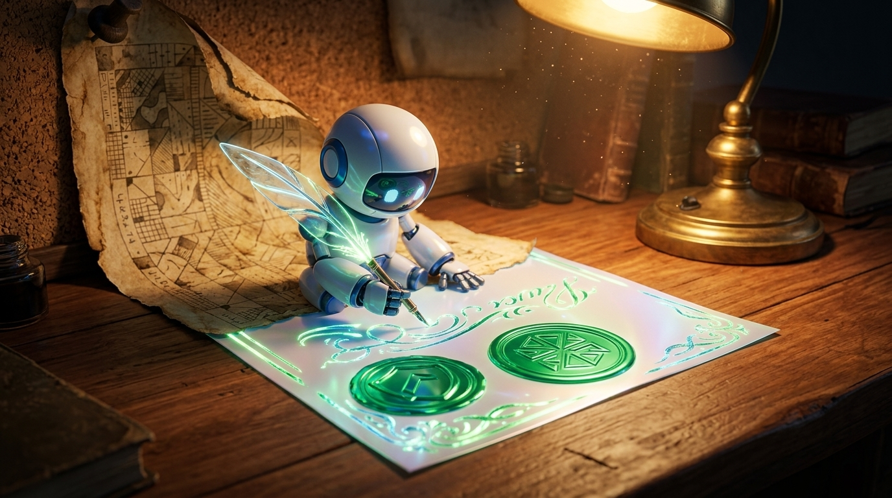
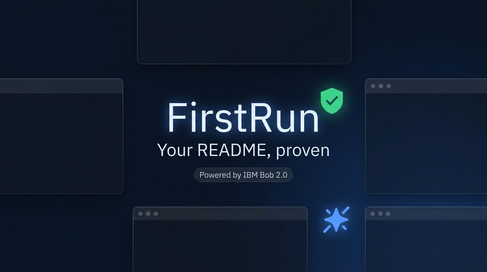

# FirstRun Explainer Video — Visual Storyboard

Keyframe storyboard generated for the 90-second animated explainer video based on Karmanya's shooting script ([`docs/pitch/animated-video-script.md`](../animated-video-script.md)).

- **Format**: 16:9, 1080p / 4K
- **Palette**: Deep navy night (`#0b1220`), Verify green (`#3ddc84`), Bob electric blue (`#4c8dff`), warm amber desk light (`#d97706`), muted red error (`#ef4444`).
- **Style**: Stylized 3D cinematic animation (Pixar-grade friendly aesthetic).
- **Rule**: Zero AI-generated pseudo-text; all typography, commands, diffs, and frozen audit statistics are overlaid in post-production.

---

## ACT 1: The Problem (0:00–0:25)

### Shot 1: Day One (Cinematic Cold Open) — 7 s

> **VO**: *"Day one. New project. The README says it just works."*  
> **Visual**: Rain streaks down a high-rise window overlooking blurred city lights. Slow dolly-in on the Newcomer at a desk under a warm amber lamp opening their laptop with hopeful anticipation.

---

### Shot 2: It Doesn't Just Work — 7 s

> **VO**: *"It never just works."*  
> **Visual**: Over-the-shoulder view. Each command sent stacks into a glowing translucent tower on the desk. The top brick flashes muted red, and the tower wobbles and collapses in slow motion.

---

### Shot 3: The Rabbit Hole — 7 s

> **VO**: *"Hours lost to a step nobody wrote down, a version that moved on, a service nobody mentioned."*  
> **Visual**: Time-lapse as night yields to pale dawn. Coffee mugs accumulate across the desk. Blank translucent cards swirl like frantic browser tabs. The developer slumps onto folded arms exhausted.

---

### Shot 4: The Quiet Truth — 4 s

> **VO**: *"READMEs don't break on purpose. They just drift."*  
> **Visual**: Macro close-up of an old paper document pinned with a wooden thumbtack to a corkboard, corner curling upward, fading with dust motes drifting through a warm sunbeam.

---

## ACT 2: FirstRun and the Crew (0:25–1:10)

### Shot 5: Enter Bob (The Spark) — 6 s

> **VO**: *"So we built FirstRun. And IBM Bob runs it."*  
> **Visual**: Out of deep darkness, a four-point electric blue spark ignites, looping with luminous orbital trails in mid-air and hovering center-frame pulsing with energy.

---

### Shot 6: The Crew Lands — 7 s

> **VO**: *"Bob sends in a crew that reads your docs the way a new teammate would."*  
> **Visual**: Bob's spark hovers over a glowing holographic blueprint floor as six rounded white-and-blue robots assemble in a cheerful semicircle: Scout (binoculars), Planner (checklist), Runner (sneakers), Doctor (stethoscope), Verifier (magnifying glass), and Scribe (quill).

---

### Shot 7: The Clean Machine — 6 s

> **VO**: *"They start on a brand-new machine. Nothing installed. Nothing assumed. Exactly like your next hire's laptop."*  
> **Visual**: Sweeping wide crane shot revealing the crew standing inside a pristine, translucent glass cube room floating in deep space with a minimalist cyan grid floor.

---

### Shot 8: Stepping Stones — 7 s

> **VO**: *"They follow your setup steps, one by one."*  
> **Visual**: Translucent hexagonal stepping-stones trace a path across the floor. The Runner robot hops cheerfully from stone to stone, each flashing bright emerald-green on contact as the Planner checks off items.

---

### Shot 9: A Break, and the Doctor — 8 s

> **VO**: *"When a step breaks, the Doctor finds out why: a missing tool, the wrong version, a service nobody started. The easy ones have known fixes. For the tricky ones, Bob steps in."*  
> **Visual**: A stepping stone cracks with warning amber-red light. The Doctor robot leans in listening with its stethoscope while Bob's blue spark circles the fracture to project the diagnosis.

---

### Shot 10: Prove It from Zero (The Money Shot) — 8 s

> **VO**: *"And nothing counts until it works again on a brand-new machine. Every fix is proven from zero."*  
> **Visual**: The Verifier robot raises a glowing magnifying glass; the entire glass room shatters into millions of glittering shards frozen in bullet-time space, reversing and rebuilding into a brand new pristine room.

---

### Shot 11: The README, Fixed — 7 s

> **VO**: *"Then the Scribe hands you a README that works, with the exact fixes, the evidence, and a badge that says so."*  
> **Visual**: At the warm desk, the Scribe robot writes glowing strokes with its luminous quill onto the document, transforming the old page into a crisp modern sheet and stamping a gleaming emerald-green verified shield badge.

---

## ACT 3: Proof and Payoff (1:10–1:30)

### Shot 12: The Real Numbers — 7 s
*(Keyframe generation quota resets shortly; prompts ready)*  
> **VO**: *"We pointed it at 16 public projects. Nine of the fourteen with setup docs broke on a clean machine. FirstRun fixed eleven breaks and proved every one from zero."*  
> **On-screen (Frozen Audit Data)**: `16 public repos · 9 of 14 broke · 11 fixes proven from zero` (Source: `audit/real-16-v3`).

---

### Shot 13: The Next Day One — 8 s
*(Keyframe generation quota resets shortly; prompts ready)*  
> **VO**: *"So your next newcomer's day one looks like this."*  
> **Visual**: Bright sunny morning. A new developer at the desk types once; the screen blooms with a colorful running app. Outside the window, Bob's tiny blue spark waves goodbye.

---

### Shot 14: End Card — 5 s

> **VO**: *"FirstRun. Your README, proven."*  
> **Visual**: Clean hero lockup: Bob's glowing electric blue spark and the emerald-green verified shield against deep navy ground.
